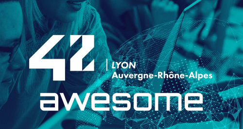

	

 

	

### À propos
Une awesome liste pour 42 Lyon ! <a href="https://github.com/sindresorhus/awesome/blob/master/awesome.md">C'est quoi une awesome list ? (anglais)</a> 
La liste est ouverte à la contribution, n'hésitez donc pas à modifier le fichier README.md, en respectant <a href="https://github.com/sindresorhus/awesome/blob/master/contributing.md">le guide de contribution (anglais)</a>, ou à m'envoyer un message sur Slack (mschneid) pour toutes demandes !

*Cette page a été réalisé par des étudiants de l'école 42 Lyon*

## Table des matières
- [Logiciels et services web](#logiciels-et-services-web)
	- [Général](#général)
	- [Audiovisuel](#audiovisuel-et-design)
	- [Outils de développement](#outils-de-développement)
- [Extensions](#extensions)
	- [Chrome/Firefox](#chromefirefox)
	- [VSCode](#vscode)
- [Ressources en ligne](#ressources-en-ligne)
	- [Général](#général-1)
	- [Programmation](#programmation)
- [Bons plans IRL](#bons-plans-irl)
	- [Bars et Restos](#bars-et-restos)

Logiciels et services web
-------------------------
*Programmes ou services en ligne utiles et gratuits utilisables sur les Macs de l'école*
- :globe_with_meridians: - Service en ligne (sans téléchargement)
- :white_check_mark: - Présent sur le MSC
- :heavy_check_mark: - Présent sur brew

#### Général
* [Undesign](https://undesign.learn.uno/) - Collection d'outils et de ressources en ligne pour la programmation ou le design :globe_with_meridians:
* [Trello](https://trello.com/) - Outil de board/Kanban/Agile, très pratique pour le travail en équipe pour la gestion de features/bugs :globe_with_meridians:

#### Audiovisuel et Design
* [Photopea](https://www.photopea.com/) - Clone de Photoshop gratuit directement depuis le navigateur, sans inscription :globe_with_meridians:
* [EZGif](https://ezgif.com/maker) - Outil de création et d'édition de GIF :globe_with_meridians:
* [DaVinci Resolve](https://apps.apple.com/fr/app/davinci-resolve/id571213070?mt=12) - Montage vidéo (à installer sur l'App Store, avec un compte Apple)
* [Archillect](http://archillect.com/about) - AI qui trouve des images en fonction d'un mot clé (pour trouver de l'inspiration) :globe_with_meridians:
* [ClipChamp](https://clipchamp.com) - Montage vidéo en ligne :globe_with_meridians:

#### Outils de développement
* [GitKraken](https://www.gitkraken.com/) - Interface user-friendly pour git :white_check_mark:
* [Git Flight Rules](https://github.com/k88hudson/git-flight-rules) - Liste de commandes facile pour git :globe_with_meridians:

Extensions
----------
*Extensions/Plugins pour navigateurs ou pour nos IDE préférés*

#### Chrome/Firefox
* [uBlock Origin](https://chrome.google.com/webstore/detail/ublock-origin/cjpalhdlnbpafiamejdnhcphjbkeiagm?hl=fr) - Bloqueur de publicité
* [Tabby Cats](https://chrome.google.com/webstore/detail/tabby-cat/mefhakmgclhhfbdadeojlkbllmecialg?hl=fr) - Remplace la page "nouvel onglet" par un chat mignon généré aléatoirement

#### VSCode
* [Live Share](https://visualstudio.microsoft.com/services/live-share/) - Programmer à plusieurs en même temps, marche comme Google Doc à plusieurs

Ressources en ligne
-------------------
*Sites de tutos, d'actualités, d'articles*

#### Général
* [Comment Devenir un bon programmeur](https://programmation.developpez.com/tutoriel/comment-devenir-bon-programmeur/?page=introduction) - Long tutoriel qui couvre beaucoup de sujets autour du métier de développeur

#### Programmation
* [HackerRank](https://www.hackerrank.com/) - Concours de programmation et plateforme de recrutement

Bons plans IRL
--------------
*Toutes les réductions qu'il est possible d'avoir en étant étudiant à 42 Lyon*

#### Bars et Restos
* [ConfluTime](https://fr-fr.facebook.com/pages/category/Bar/ConfluTime-1841249056168178/) - Bar proche de l'école, Happy Hours constant pour les students avec la carte - 5€/pinte
